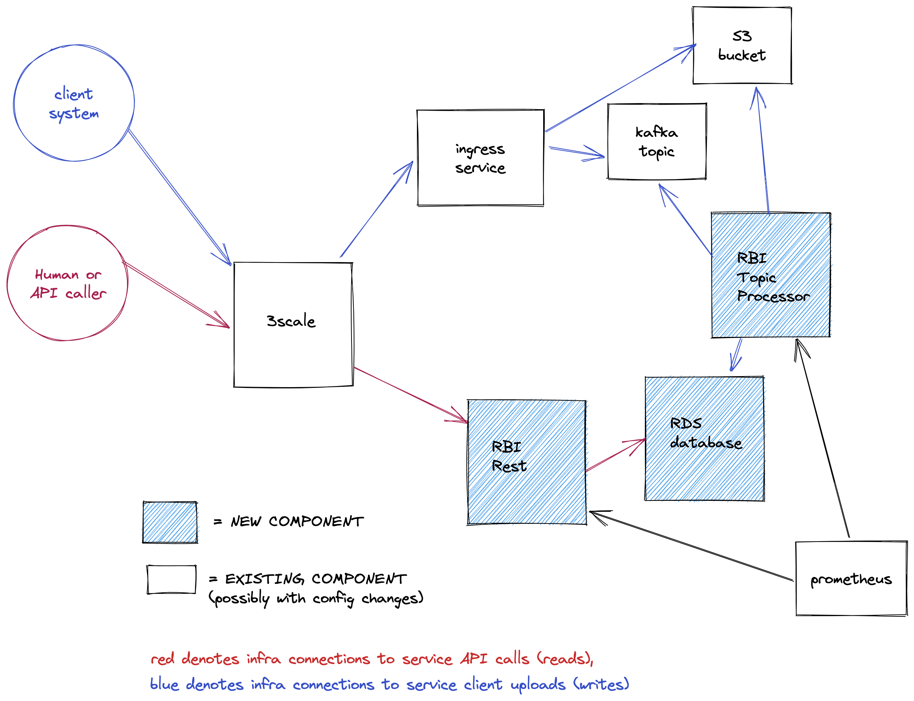

# insights-runtimes-inventory

## Service Description

Runtimes Based Inventory (RBI) is a service that manages data for Runtimes workloads. It is intended to serve the same role for Runtimes that Host-Based-Inventory does for RHEL Insights.

## Components

Both components come from the same Quarkus codebase, with just a different entrypoint into the container used.

This will be split into 2 sets of pods (in Staging & Prod) to allow independent scaling of the two operations.

Both sets will run the same image (with a flag for setting which mode, or both modes for development purposes)

### rbi-rest

This component provides a simple REST interface to read data from the customer's dataset.

### rbi-topic-read

A Kafka listener that writes data into an RDS postgres instance.

## Routes

Routes into RBI are controlled by 3Scale.

console.redhat.com/api/runtimes-inventory/v1/openapi.json
Has a description of the API (autogenerated)

console.redhat.com/api/runtimes-inventory/v1/workloads
Will expose an access-controlled list of UUIDs that identify individual Runtimes workloads instances, and the RHEL host they are running on. Will support date parameters (defaulting to last 24 hours)

console.redhat.com/api/runtimes-inventory/v1/workloads/<UUID>
The details for a specific workload.

Access control for both routes is “customer can only access their own data, that matches their accountId & orgId”

## Dependencies

### RDS

RBI uses a Postgres database hosted on AWS. If the database is unavailable, this will be a major outage for the application. As soon as the database is available again, the application will recover by itself.

Migration and upgrades are handled Flyway scripts. Quarkus uses Flyway as a standard DB migration / versioning tool - https://flywaydb.org/

It’s widely deployed at Red Hat & is used on Insights by e.g. notifications-backend.

### Kafka

RBI uses the main consoledot Kafka and dedicated topics. RBI is agnostic to the type of Kafka used.

## Service Diagram

## Application Success Criteria

Store and process information related to the usage of EAP and other Runtimes products - to allow us to understand customer usage.

## State

### Postgres RDS

The database stores all application-related data. If unavailable, the application will have a significant outage. Past workload statuses will be lost in case of data loss.

## Load Testing

Tbd

## Capacity

| Component            | CPU (request/limit) | Memory (request/limit) | Storage |
| -------------------- | ------------------- | ---------------------- | ------- |
| rbi-rest             | 2x 300m/1           | 2x 256Mi/256Mi         | -       |
| rbi-topic-read       | 2x 300m/1           | 2x 256Mi/256Mi         | -       |
| RDS                  | db.m6g.large        | db.m6g.large           | 50Gi    |

We don't expect significant changes in the capacity requirements in the next 6 months.
